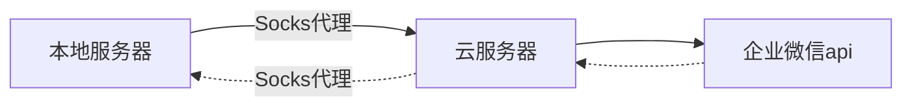

最近在网上看到了使用微信测试公众号给女朋友弄的每日推送。不过还是有很多问题的，主要是不能更改头像和名字，非常的不优雅。于是找到了企业微信的api，非常满足我的需要求。

于是打算自己重新写一个。[直达链接](https://github.com/JavaZeroo/wechat-bot) (目前还没有施工完🛠️)

## 主要思路

首先我们需要明确需求：需要一个**固定的公网ip来访问企业微信的api**。

那第一反应当然就是租用云服务器，然后同时购买固定的公网ip，然后再把云服务器作为代理服务器，帮助我们去访问企业微信api。




**为什么用Socks代理而不用http？**

- 主要是因为http代理无法代理https的流量，比较麻烦。

- Socks代理性能更好，因为他只负责转发流量，简单理解为Socks代理更纯粹。


## 实际操作

我的内核：

CentOS Linux release 7.6.1810 (Core)


### 安装socks5服务端

项目地址：[https://github.com/Lozy/danted](https://github.com/Lozy/danted)

项目给出了两种安装方式，我这里使用的是脚本安装，直接安装在服务器上。(主要是腾讯云上貌似没有自带docker，懒得折腾了)

首先下载脚本
```bash
wget --no-check-certificate https://raw.github.com/Lozy/danted/master/install.sh -O install.sh 
```

安装脚本
```bash
chmod +x install.sh && ./install.sh
```

**默认配置的端口是2016，且没有账号密码！！！！**

如果需要自定义参数可以加上：

```bash
--port=端口 \
--user=账号 \
--passwd=密码
```



### 后续配置





## 参考

Socks：https://cloud.tencent.com/developer/article/1682604?from=15425

安装：https://blog.csdn.net/weixin_44471270/article/details/121343578
 