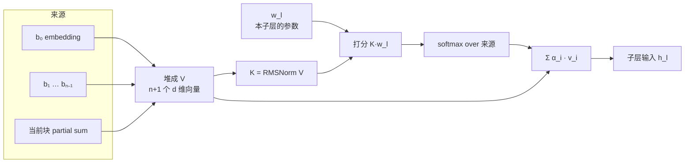

import K3ArchDiagram from '../../components/k3/K3ArchDiagram.astro';
import K3LayerStrip from '../../components/k3/K3LayerStrip.astro';
import AttnResVariants from '../../components/k3/AttnResVariants.astro';

对应论文 §2.2 "Attention Residuals"，公式 (8) 到 (10)。这一节论文只写了一页，因为它假设你读过 Kimi 团队三个月前的那篇 [Attention Residuals](https://arxiv.org/abs/2603.15031)。本文把那篇论文里需要的部分补上，再对照 Hugging Face 的建模代码看 K3 到底是怎么接线的。

<K3ArchDiagram highlight="attnres" caption="你现在在这里：每个子层前面的 α 算子、左侧的来源列表，以及输出前的最后一次聚合。" />

## 残差连接是深度上的 RNN

先把普通的 pre-norm Transformer 写开。记 $h_l$ 是第 $l$ 个子层的输入，$f_l$ 是子层本身（注意力或 FFN，各算一个子层），$h_1$ 是词嵌入。残差连接是

$$
h_l = h_{l-1} + f_{l-1}(h_{l-1})
\quad\Longrightarrow\quad
h_l = h_1 + \sum_{i=1}^{l-1} f_i(h_i).
$$

展开之后能看出三件事，正是 AttnRes 论文列出的三个问题：

1. **权重固定。** 每一层拿到的都是同一个和，embedding 和所有先前输出的系数全是 1。注意力子层和 FFN 子层可能想要不同的组合，但它们只能看到一个被压缩过的状态 $h_{l-1}$。
2. **丢了就找不回。** 被求和糊掉的信息，后面的层没有办法按内容单独取回某一层的输出。
3. **幅度随深度增长。** pre-norm 下 $\|h_l\|$ 随深度按 $O(L)$ 增长，每一层的相对贡献随之缩小。越深的层要维持影响力，就得从归一化过的、尺度固定的输入里学出越来越大的输出，训练变得不稳。

把这三条放在一起，会发现残差流在深度方向上的形态，和 RNN 在时间方向上一模一样：一个状态、一路累加、只能通过前一个状态间接接触历史。线性注意力的 $S_t = S_{t-1} + k_t v_t^\top$ 也是这个形状。Transformer 在序列方向上用注意力取代了这种递推，让每个位置都能带权重地访问全部历史。AttnRes 的想法就是对深度做同样的事：

$$
h_l = \alpha_{0\to l}\, h_1 + \sum_{i=1}^{l-1} \alpha_{i\to l}\, f_i(h_i),
\qquad \sum_{i=0}^{l-1} \alpha_{i\to l} = 1.
$$

深度很小（K3 是 186 个子层，论文写 $L$ 小于 100 是按 decoder layer 数），在深度上做 $O(L^2)$ 的注意力算术上便宜。真正的代价在别处，后面讲。

## Full AttnRes：每个符号是什么

论文公式 (8)、(9)。对第 $l$ 个子层：

$$
q_l = w_l \in \mathbb{R}^d,
\qquad
k_i = v_i =
\begin{cases}
h_1 & i = 0 \\
f_i(h_i) & 1 \le i \le l-1
\end{cases}
$$

$$
\alpha_{i\to l} = \frac{\phi(q_l, k_i)}{\sum_{j=0}^{l-1}\phi(q_l, k_j)},
\qquad
\phi(q, k) = \exp\!\big(q^\top \operatorname{RMSNorm}(k)\big),
\qquad
h_l = \sum_{i=0}^{l-1} \alpha_{i\to l}\, v_i .
$$

逐个拆开：

**query 是一个参数，不是投影。** $w_l$ 是每个子层各自拥有的一个 $d$ 维可学习向量，所有 token、所有位置共用。它不从隐藏状态算出来。这是刻意的设计：因为 $w_l$ 和前向过程无关，一个块里所有层的打分可以在这些层运行之前就批量算好，后面讲推理时会用到这一点。论文消融过把 query 改成从隐藏状态投影出来（每层多一个 $d\times d$ 矩阵），loss 更好一点，但推理时被迫顺序访存，所以放弃了。

**但权重仍然是逐 token、依赖输入的。** key 是这个 token 自己在各层的输出，所以 $\alpha_{i\to l}$ 对每个 token 都不同。这一点区别于 DenseFormer 那种训练完就固定的逐对标量。

**key 做 RMSNorm，value 不做。** 只有打分用的 key 归一化，加权求和的是原始的 $v_i$。目的是不让输出幅度天然大的层霸占 softmax。每个子层因此多了一个 RMSNorm 和一个 $w_l$，参数量可以忽略。原来 pre-norm 里那个 RMSNorm 还在，作用在 AttnRes 的输出上，再进 $f_l$。

**embedding 是 0 号来源，softmax 把它算在内。** 没有单独的恒等通路，"残差"就是这个加权和本身。

**零初始化。** 所有 $w_l$ 初始化为 0，于是一开始 $\alpha$ 全部均匀，AttnRes 退化成对先前所有输出的等权**平均**。注意是平均而不是普通残差的求和，论文说这样起步训练最稳。

**没有多头。** 每个来源每个 token 只有一个标量权重。论文试过分 16 组通道做多头，结果更差，他们的解释是「一层的输出如果有用，就是整体有用」。

## 三种残差的对比图

<AttnResVariants />

(b) 和 (c) 的差别只在左边那一列有多少东西。Full 形式里，每个子层的输出都单独保留，任何一个后续子层都能单独取回它。Block 形式里，块内的输出被求和成一个代表，只有块的和能被跨块取回。

## Block AttnRes：K3 用的形式

Full 形式的问题不在算术，在内存和通信。要让第 $l$ 层能看到前面所有层的输出，就得把 $L$ 个 $d$ 维向量都留着，每 token $O(Ld)$。训练时如果开了激活重算和流水线并行，这些向量还得跨 stage 传。

Block AttnRes（论文公式 (10)）把 $L$ 个子层切成 $N$ 块，每块 $S = L/N$ 个连续子层：

- **块内：普通残差求和。** $b_n = \sum_{j \in \mathcal{B}_n} f_j(h_j)$，$b_n^{i}$ 记块内前 $i$ 个子层的部分和。
- **embedding 是 0 号块。** $b_0 = h_1$，永远是一个来源。
- **块间：对块的代表做注意力。** 块 $n$ 里第 $i$ 个子层的 value 矩阵是

$$
V =
\begin{cases}
[\,b_0, b_1, \dots, b_{n-1}\,] & i = 1\ \text{（块的第一个子层）} \\
[\,b_0, b_1, \dots, b_{n-1},\ b_n^{\,i-1}\,] & i \ge 2
\end{cases}
$$

key 和 $\alpha$ 的算法与 Full 形式相同。所以一个子层最多看到 $n+1$ 个来源：embedding、$n-1$ 个已完成的块、以及本块正在累加的部分和。**这个部分和就是块内的普通残差流**。key 上的 RMSNorm 在这里更重要：一个刚开始累加的小部分和，与一个已经加完 12 层的大块和，要在同一个 softmax 里公平竞争。

最后的输出层再用同一个算子聚合所有 $N$ 个块。内存和通信从 $O(Ld)$ 降到 $O(Nd)$。$N = L$ 就退化回 Full 形式，$N = 1$ 是普通残差外加一个单列出来的 embedding 来源。论文的块大小扫描显示 $N \approx 8$ 已经拿到绝大部分收益，所以 K3 选了 8 块。

## K3 的接线：93 层、8 块、9 个来源

<K3LayerStrip caption="attn_res_block_size = 12。边界在第 1、13、25、…、85 层，切出 7 个满块和一个 9 层的尾块。" />

论文只有一句话：分成 8 个 12 层的块，最后一块不满，算上 embedding 共 9 个块。config 里 `attn_res_block_size = 12`。到代码里才能看清具体怎么接，下面以 Hugging Face 上的 `modeling_kimi_linear.py` 为准，层号用代码的 0-indexed。

```python
def _forward_attn_residual(self, hidden_states, ..., block_residual):
    prefix_sum = hidden_states                      # 进入本层时的块内部分和

    if block_residual.shape[1] > 0:                 # 第 0 层还没有任何来源，跳过
        hidden_states = _apply_attn_res(prefix_sum, block_residual,
                                        self.self_attention_res_proj,
                                        self.self_attention_res_norm)

    if self.layer_idx % self.attn_res_block_size == 0:   # 块边界：0, 12, 24, …, 84
        block_residual = torch.cat([block_residual, prefix_sum.unsqueeze(1)], dim=1)
        prefix_sum = None                            # 新块从零开始累加

    hidden_states = self.input_layernorm(hidden_states)
    hidden_states = self.self_attn(hidden_states, ...)
    prefix_sum = hidden_states if prefix_sum is None else prefix_sum + hidden_states

    hidden_states = _apply_attn_res(prefix_sum, block_residual,
                                    self.mlp_res_proj, self.mlp_res_norm)
    hidden_states = self.post_attention_layernorm(hidden_states)
    hidden_states = self.block_sparse_moe(hidden_states)   # 第 0 层是 self.mlp
    prefix_sum = prefix_sum + hidden_states

    return prefix_sum, block_residual
```

读出来的几个事实，论文里都没有明说：

- **每个 decoder layer 里有两次 AttnRes**，注意力前一次（`self_attention_res_proj / _norm`），MoE 前一次（`mlp_res_proj / _norm`）。93 层就是 186 个子层，每个子层一对 $w_l$ 和 RMSNorm，和论文的 sublayer 口径一致。
- **块边界的处理。** 在边界层，先用旧的 `prefix_sum` 作为最后一个来源做一次 AttnRes（这就是公式 (10) 里 $i = 1$ 的情形，只是刚完成的块 $b_{n-1}$ 以「上一块的部分和」的身份出现在末尾），然后把它推进 `block_residual` 成为正式的 $b_{n-1}$，`prefix_sum` 清空。第 0 层是特例：`block_residual` 还是空的，直接把 embedding 推进去当 $b_0$。
- **来源数。** 边界在 0、12、…、84 共 8 处，前 7 处各推进一个 12 层的块和，第 84 层推进的是第 72 到 83 层的和。第 84 到 92 层这 9 层构成尾块，它们看到的 `block_residual` 有 8 项（$b_0$ 到 $b_7$），加上自己的部分和，正好 9 个来源。前面的层看到的更少，第 1 层的注意力前只有 2 个：$b_0$ 和刚才第 0 层的输出。
- **输出聚合。** 所有层跑完后，`_apply_output_attn_res` 用一对独立的 `output_attn_res_proj / _norm`，把最终的 `prefix_sum`（尾块的完整和）和 8 个已完成的块一起再做一次注意力，然后才是最终 RMSNorm 和 LM head。这就是论文说的「最终输出层聚合所有块」。

算子本身只有十行：

```python
def _apply_attn_res(prefix_sum, block_residual, proj, norm):
    v = torch.cat((block_residual, prefix_sum.unsqueeze(1)), dim=1)   # [tokens, n+1, d]
    v_float = v.float()
    variance = v_float.pow(2).mean(-1, keepdim=True)
    k = v_float * torch.rsqrt(variance + norm.variance_epsilon)       # RMSNorm 的归一化部分
    score_weight = norm.weight.float() * proj.weight.squeeze(0).float()
    scores = (k * score_weight).sum(-1)                               # w_l · RMSNorm(v_i)
    probs = scores.softmax(-1).unsqueeze(1)                           # 对来源做 softmax
    hidden_states = torch.matmul(probs, v_float).squeeze(1)           # 用原始 v 加权求和
    return hidden_states.to(v.dtype)
```

`proj` 是一个 `nn.Linear(d, 1, bias=False)`，它的权重就是 $w_l$。RMSNorm 的逐通道增益被折进了打分向量：$w_l^\top \operatorname{RMSNorm}(k) = \sum_c \frac{k_c}{\mathrm{rms}(k)}\, g_c\, w_{l,c}$。整段在 FP32 里算，打分和 softmax 都不走 BF16。



## 推理时怎么算：两阶段与 online softmax

这是 Block 形式相对 Full 形式的第二个好处，也是 $w_l$ 为什么必须是参数而不是投影的原因。对块 $n$：

**阶段一，并行。** 把块内所有 $S$ 个子层的伪 query 堆成 $Q \in \mathbb{R}^{S\times d}$，已完成的来源堆成 $K = V \in \mathbb{R}^{n \times d}$。一次 batched matmul 给每个子层算出未归一化的输出 $o^{(1)}_l$、行最大值 $m^{(1)}_l$ 和指数和 $\ell^{(1)}_l$。因为 $Q$ 全是参数，这一步可以在块里任何一层执行之前就做完，和块的第一层重叠。

**阶段二，顺序。** 块内每一层多出来的那个来源，只有当前的部分和 $b_n^{i}$。对它算一次单 key 的注意力得到 $(o^{(2)}_l, m^{(2)}_l, \ell^{(2)}_l)$，然后用 online softmax 的合并公式把两部分接起来：

$$
m_l = \max(m^{(1)}_l, m^{(2)}_l),
\qquad
h_l = \frac{e^{m^{(1)}_l - m_l}\, o^{(1)}_l + e^{m^{(2)}_l - m_l}\, o^{(2)}_l}
           {e^{m^{(1)}_l - m_l}\, \ell^{(1)}_l + e^{m^{(2)}_l - m_l}\, \ell^{(2)}_l}.
$$

合并是逐元素的，可以融进相邻的 kernel。AttnRes 论文给的访存账是每 token 每层普通残差 $3d$，Block AttnRes 约 $5.5d$，Full 形式 $24d$，mHC 约 $34d$；实测推理延迟开销小于 2%。

K3 的 §5 顺着这条路又做了几件事，第 7 篇会展开，这里只列结论：

- **训练。** 块代表在边界层生成一次、留在 GPU 上被后续所有层共用；AttnRes 的计算整体包进 activation checkpointing，每层为反向保存的激活和普通残差结构完全一样；流水线并行用 AttnRes 论文的 cache-based 通信，stage 之间只增量传新生成的块。
- **prefill。** 在每个 TP rank 上都物化块代表太浪费显存，于是对激活做 sequence parallel：把 TP 的 all-reduce 拆成 reduce-scatter 和 all-gather，块内的 AttnRes kernel 夹在两者之间，作用在按序列切片的隐藏状态上，每个 token 的块代表只在一个 rank 上存在。
- **decode。** 块间那一步放到 side stream 上和主流的独立计算重叠；块内那一步不再单独起 kernel，把 AttnRes 输出的合并、部分和的更新和后面的 RMSNorm 一起融进前一个 TP all-reduce。

还有一个和结构直接相关的用法：部署时 K3 把 MTP 层微调成 EAGLE-3 风格的 draft，draft 的输入是目标模型第 1、第 4 和最后一个 AttnRes 块的输出拼接（低、中、高三层特征），融合矩阵初始化为 $[\,0\ \ 0\ \ I\,]$，让它一开始等价于只用最后一块。块代表在这里成了现成的多层特征接口。

## 它带来什么

AttnRes 论文用 Kimi Linear 系列做的实验，K3 直接继承了结论：

- **scaling law。** 五个 MoE 尺寸（194M 到 528M 激活），拟合 $L = A\,C^{-\alpha}$，Block AttnRes 的曲线和基线斜率相同、整体下移，在 5.6 PFLOP/s-days 处 loss 1.692 对 1.714，相当于 **1.25 倍的有效算力**。Full 和 Block 的差距随规模缩小，最大尺寸上只差 0.001。
- **48B 模型下游。** 同样的 Kimi Linear 48B/3B 配方，GPQA-Diamond 36.9 → 44.4（+7.5），MATH 53.5 → 57.1，HumanEval 59.1 → 62.2，其余任务持平或略升。收益集中在多步推理和代码，论文的解释是后面的层能选择性地取回并在早期表示上继续构建。
- **输出幅度。** 基线每个 block 的输出幅度随深度单调增长，到第 27 块约 15；Block AttnRes 的幅度是有界的**锯齿**，每到块边界就重置一次，因为选择性聚合让累加从头开始。这直接对应开头的第三个问题。
- **梯度分布。** 基线最早几个块的梯度不成比例地大，AttnRes 的梯度沿深度平得多。softmax 对概率质量的竞争把梯度摊开了。
- **学到的模式。** 权重热图上，最强的权重仍在紧邻的前一个来源，保持了局部性；但出现了明显的非对角集中，等于学出了跨层的 skip connection。embedding 作为 0 号来源在所有深度都保有不小的权重，尤其是注意力子层前，这是**深度方向上的 attention sink**，和序列方向上的现象对得上。注意力子层前的权重分布更宽，FFN 前的更集中在对角线上：注意力在跨层路由，FFN 在做局部处理。
- **模型形状偏好。** 固定算力扫模型形状，基线的最优宽深比 $d_{\text{model}}/L_b$ 约 60，加 AttnRes 后移到约 45。AttnRes 更喜欢深而窄的模型，代价是深度直接换推理延迟。K3 从 K2 的 61 层加到 93 层，和这个结论方向一致。

## 和相近工作的区别

AttnRes 论文 §6 给了一个统一视角：把任何残差结构写成 $h_l = \sum_{i<l} M_{i\to l}\, v_i$，$v_0 = h_1$，$v_i = f_i(h_i)$，看这个深度混合矩阵 $M$ 长什么样。

| 方法 | $M_{i\to l}$ | 一句话 |
|---|---|---|
| 普通残差 | 全 1 的下三角 | 秩 1，权重固定 |
| Highway / 门控残差 | $g_{i+1}\prod_{j=i+2}^{l}(1-g_j)$ | 输入相关，但只能通过前一状态间接访问，等价于 stick-breaking |
| Hyper-Connections / mHC | $\beta_i^\top A^\times_{i+1\to l}\, \alpha_l$ | 把残差流拓宽成 $m$ 条，等价于**深度上的线性注意力**，状态是矩阵 |
| DenseFormer | 训练后固定的逐对标量 | 无输入相关性，消融显示几乎没有收益（1.767 对基线 1.766） |
| LAuReL | 对前 $k$ 个激活做低秩投影 | 有限窗口 |
| **Full AttnRes** | $\phi(w_l, k_i)$，稠密 | **深度上的 softmax 注意力**，秩 $L$ |
| **Block AttnRes** | 同一块内的来源共享一个条目 | 秩在 $N$ 和 $N+S$ 之间 |

这个视角下 mHC 和 AttnRes 的关系，正好就是序列方向上线性注意力和 softmax 注意力的关系。论文另一个有用的消融是滑动窗口：只对最近 8 个输出加 embedding 做注意力，loss 1.764，几乎和基线一样。**重要的是能选择性地访问远处，而不是附近有很多来源**。

## 术语坑

- **"layer" 指什么。** AttnRes 论文里一个 layer 是一个子层，一个 Transformer block 贡献两个 layer。K3 论文和 config 里 layer 是 decoder layer。K3 的「12 层块」是 12 个 decoder layer，等于 AttnRes 论文口径的 24 个子层、24 对 $(w_l, \operatorname{RMSNorm})$。上一节代码里 `layer_idx % 12` 用的是 decoder layer。
- **公式里的 $L$ 小于 100。** 按 decoder layer 数 93 说的。按子层数是 186。
- **块代表不是块的输出。** $b_n$ 是块内所有子层输出的和，不包含进入该块时的输入。进入下一块的第一个子层看到的是 $[b_0, \dots, b_{n}]$ 的加权和，不是 $b_n$ 加上什么。

## 下一篇

第 5 篇进入宽度维度：Stable LatentMoE。它和本篇的关系比看起来近，因为 LatentMoE 那个「在 latent 空间里跑 expert」的四连矩阵乘，正是 K3 加 RMSNorm 和 SiTU-GLU 去稳住的对象，而 AttnRes 的锯齿输出幅度是它的邻居。

## 资料

- Attention Residuals 论文：[arXiv 2603.15031](https://arxiv.org/abs/2603.15031)。arXiv 的 HTML 版目前是空的，请看 PDF。代码与 README 里的参考实现：[MoonshotAI/Attention-Residuals](https://github.com/MoonshotAI/Attention-Residuals)
- K3 的实现：Hugging Face [moonshotai/Kimi-K3](https://huggingface.co/moonshotai/Kimi-K3) 里的 `modeling_kimi_linear.py`，搜 `_apply_attn_res`
- mHC（Hyper-Connections 的流形版）和 DenseFormer 是本篇对照表里最值得顺手读一下的两个
