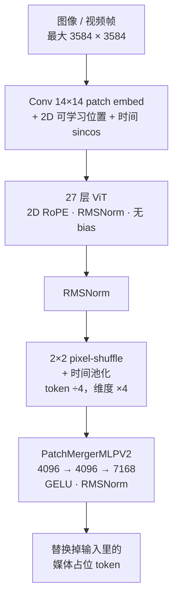

import K3ArchDiagram from '../../components/k3/K3ArchDiagram.astro';

对应论文 §2.4、§2.5 和 §4.1.4 里关于 draft 模型的部分。这一篇没有新的数学，是把主干之外的零件逐个对上 config 和代码。

<K3ArchDiagram highlight={['vision', 'mtp', 'embed']} caption="你现在在这里：顶部的视觉通路和 embedding，底部的 MTP 层。" />

## MoonViT-V2：从零训练的视觉编码器

K3 的视觉编码器和 K2.5 最大的不同是**没有用 SigLIP 初始化，而是从零开始，用 next-token prediction 直接训**。惯例是拿一个对比学习预训练好的编码器接到语言模型上，理由是预训练的视觉知识能给个好起点。K3 放弃这个惯例，主要理由是训练稳定性：把预训练编码器接到 LLM 上联合优化时，SigLIP 初始化的 MoonViT-3D 梯度范数持续偏高、频繁尖峰；从零训的 MoonViT-V2 全程平稳（论文 Fig. 6）。

另外两个理由：NTP 直接塑造编码器的表示，而对比损失偏好全局语义、忽略细粒度的文字和结构；实测 MoonViT-V2 在视觉评测上和 SigLIP 初始化的基线持平，说明对比预训练在这个规模上不是必要的初始化。

### 结构

| 字段 | 值 |
|---|---|
| 层数 / 参数 | 27 / 约 0.4B |
| hidden | 1024 |
| 注意力头 / 头维 | 12 / 128（`qkv_hidden_size = 1536`） |
| MLP | 1024 → 4096 → 1024，GELU（tanh 近似） |
| 归一化 | RMSNorm，pre-norm |
| bias | 线性层和注意力投影全部无 bias |
| patch | 14 × 14 |
| 位置编码 | patch embed 处：可学习的 2D 位置嵌入（初始 64×64，双线性插值到实际网格）加固定的 1D 正弦时间嵌入（初始 4 帧）；注意力里：2D RoPE |

无 bias 加 RMSNorm 是为从零训练的稳定性做的选择。

### 通路

逐段说明：

- **patch embed。** 14×14 的卷积，无 bias，输出 1024 维。每张图（或每个视频片段）带一个 `(t, h, w)` 网格，位置嵌入按网格插值。
- **27 层编码。** 每层是标准的 pre-norm 注意力加 MLP，注意力里对 q、k 施加 2D RoPE。代码里一个样本的 $t \cdot h \cdot w$ 个 token 用变长注意力**一起**算（`cu_seqlens` 按样本切），也就是空间和时间联合的注意力。论文的描述是「注意力分解为帧内空间和帧间时间两遍」。两者有出入，以你跑的代码为准。
- **合并（`merge_type = sd2_tpool`）。** 先把 $h \times w$ 的网格按 2×2 分组，4 个相邻 patch 的 1024 维向量拼成 4096 维，token 数除以 4；同时对时间维取平均，一个 $t$ 帧的片段被池化成一帧的 token 数。这就是论文说的「2×2 pixel-shuffle 下采样」和「时间池化」。
- **投影（`PatchMergerMLPV2`）。** 4096 → 4096 → 7168，GELU，无 bias，最后接一个 7168 维的 RMSNorm。输出直接替换掉文本序列里 `<|kimi_image_placeholder|>`（id 163605）的位置，进主干。

### 一张图多少 token

| 输入 | patch 数 | 合并后 token 数 |
|---|---|---|
| 448 × 448 | 32 × 32 = 1024 | 256 |
| 1792 × 1792 | 128 × 128 = 16384 | 4096 |
| 3584 × 3584（上限） | 256 × 256 = 65536 | **16384** |

论文说 2×2 下采样让 3584×3584 的输入在 1M 上下文里「可负担」。视频每个片段的多帧被池化成一帧，token 数按帧数除。

### 训练方式

K3 是原生多模态：文本和视觉从预训练一开始就联合优化，交错在同一个 NTP 目标里，没有事后的模态对齐阶段。论文把这当成「视觉在环」长程行为的基础：模型写代码、看结果的截图或视频帧、再改，都在一条 token 流里。训练系统上，大图和长视频的编码计算用上下文并行切开，ViT 的前向反向塞进流水线气泡里，这些放到第 7 篇。

## MTP 层与 EAGLE-3 draft

预训练时 K3 带一个 **多 token 预测（MTP）层**，结构镜像一个主干 block。Table 1 里 K2 和 K3 都是 1 层 MTP。HF config 里 `num_nextn_predict_layers = 0`，公开的权重可能没有包含这一层，所以下面的内容以论文为准，代码里对不上。

部署时 MTP 层被**微调成 EAGLE-3 风格的 draft 模型**，目标模型冻结，只训 draft 层和特征融合投影：

- **输入。** EAGLE-3 的 draft 融合目标模型的低、中、高三层特征。K3 取的是第 1、第 4 和最后一个 AttnRes 块的输出（[第 4 篇](/2026/09/05/kimi-k3-04-attnres/)里的 $b_1$、$b_4$ 和末块）。三个 7168 维向量拼接后由一个无 bias 的矩阵 $W_{\text{E3}}$ 投回 7168 维。
- **初始化。** $W_{\text{E3}} = [\,0\ \ 0\ \ I\,]$，让融合后的表示在初始时等于高层特征，也就是 MTP 层预训练时看到的输入，然后在微调中逐渐学会用低、中层特征。
- **训练。** 按 EAGLE-3 的 training-time test 协议展开 7 步，第一步之后 draft 消费自己之前的输出，和推理时的递归 drafting 一致。
- **损失。** 投机解码的加速由接受率 $\sum_x \min(p(x), q(x))$ 决定，最小化 KL 不保证最大化它，K3 直接优化 LK 损失，即接受率的负对数。

AttnRes 的块代表在这里成了现成的多层特征接口，这是第 4 篇里那 9 个来源的一个副产品。KDA 在投机解码下的状态回滚是另一个系统问题，第 7 篇讲。

## Per-Head Muon

K3 沿用 K2 的 Muon 优化器处理矩阵参数，另加 K2 引入的权重裁剪。Muon 的核心是对动量矩阵做 Newton–Schulz 迭代近似正交化，再当作更新量。

K3 的改动只针对注意力投影：**不对整个 $W_q$、$W_k$、$W_v$ 做正交化，而是把动量矩阵沿头的维度切开，每个头的块单独正交化。** 理由：整矩阵正交化把所有头当成一个耦合的块，梯度或动量尺度大的头主导共享的更新方向，尺度小的头得到的更新归一化不足；按头正交化让各头的更新尺度对齐。论文说这带来更均衡的跨头学习动态、更好的大规模稳定性，还顺便省了一点开销，因为对瘦长的每头块做 Newton–Schulz 比对整个矩阵便宜。

它是优化器，不是结构，但它决定了「头」这个结构单元在训练时被怎么对待，所以放在这里。

## 零碎的事实

- **第 1 层是稠密 FFN**，中间维 33792，`first_k_dense_replace = 1`。K2 也是 1 层稠密。用的激活同样是 SiTU-GLU。
- **词表 163840**。特殊 token：bos 163584，eos 163586，pad 163839，媒体占位 163605。论文 Table 1 写的 160K 是四舍五入。
- **LM head 不与 embedding 共享权重**（`tie_word_embeddings = false`）。两者各 7168 × 163840 ≈ 1.17B 参数。
- **RMSNorm 的 eps 是 $10^{-5}$**，全模型统一。
- **权重 dtype 是 BF16**，routed expert 权重发布时是 MXFP4（group size 32），其余部分不量化。

## 术语坑

- **MoonViT-3D、MoonViT-V2。** 3D 是 K2.5 里 SigLIP 初始化的那个，V2 是 K3 从零训的这个，两者视频处理的参数共享方式相同。代码里的类名还叫 `MoonViT3d*`。
- **时空注意力是分解的还是联合的。** 论文说分解，HF 代码是联合。可能是训练实现和推理参考实现的差别，写论文笔记时标注一下。
- **MTP 层的权重可能没公开。** `num_nextn_predict_layers = 0`。

## 下一篇

最后一篇换个角度：这些结构选择迫使系统那边做了什么。FlashKDA、KDA 的上下文并行为什么不能像普通线性注意力那样直接把状态加起来、混合架构的前缀缓存怎么做，以及投机解码下 KDA 状态怎么回滚。
